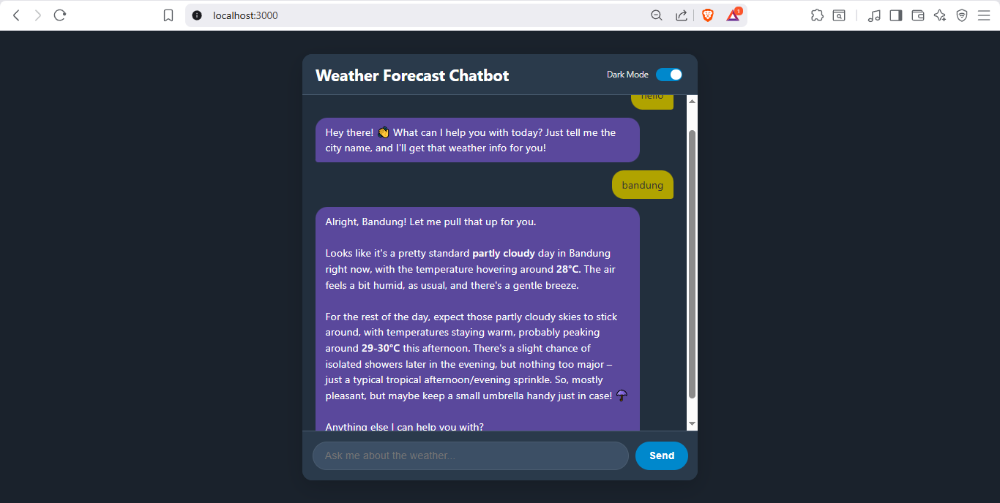

---

## Project Description

This is the final project of AI Productivity and AI API Integration for Developers which is part of the AI Opportunity Fund: Asia Pacific, in collaboration with AVPN and supported by Google.org and the Asian Development Bank.

## Project Objective

A fully working chatbot based on Gemini AI Model made entirely with Gemini Code Assist on Google Antigravity.

## Tech Stack

This project is made with **HTML, CSS, and JavaScript** with these library:

| No | Library | Function
| :--- | :--- | :--- |
| 1 | **Express** | Preparing REST API |
| 2 | **dotenv** | Loading the Gemini API key safely from .env file |
| 3 | **@google/genai** | Connecting the app to Gemini API (including the Gemini 2.5 Flash Model) |
| 4 | **cors** | Allowing request from multiple origin (domain) to access the endpoint on the server  |

**Supporting Tools:**
* **Google Antigravity**: As main *Integrated Development Environment* (IDE) for writing and managing the program code
* **Postman**: For testing the API before integrated to front-end
* **Node.js**
* **Express**
* **Google Gemini API**
* **npm**
* **ES Modules**

**Gemini Config:**
* **temperature**

**System Instruction:**
* **Casual & concise weather chatbot that ask for the user city**

## Project Output 

  
  <h1 style="margin-top: 0px;">Weather Chatbot</h1>
  
<i>Your Personal Weather Forecast Chatbot</i>

